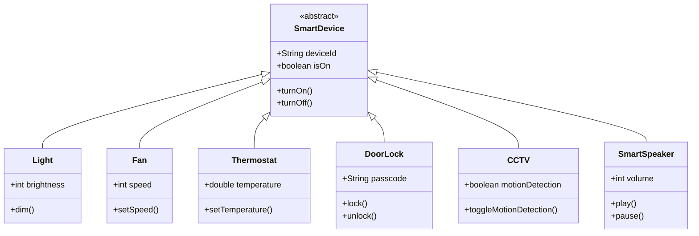

# 🏠 Smart Home System  
### *Java OOP Project*


> A modular smart home controller that brings Object‑Oriented Programming to life.  
> Manage lights, fans, thermostats, door locks, CCTV, and speakers — all through a single, elegant interface.

---

## 🧬 Class Hierarchy



---

## ✨ Features

| 💡 **Smart Light** | 🌬️ **Smart Fan** | 🌡️ **Smart Thermostat** |
|-------------------|------------------|------------------------|
| Dimming control   | Speed regulation | Precise temperature   |
| On/Off toggling   | Auto mode        | Scheduling            |

| 🔒 **Door Lock** | 📹 **CCTV** | 🎙️ **Smart Speaker** |
|------------------|-------------|---------------------|
| Passcode secure  | Motion detection | Volume control   |
| Remote unlock    | Night vision     | Music playback   |

---

## 🧠 OOP Concepts in Action

| Concept           | How It's Used                                                                 |
|-------------------|-------------------------------------------------------------------------------|
| **Encapsulation** 🔒 | Private fields with public getters/setters — data is protected.              |
| **Inheritance** 🌳   | All devices extend `SmartDevice`, reusing common code while adding unique features. |
| **Polymorphism** 🎭  | `ArrayList<SmartDevice>` stores any device; calling `turnOn()` works for all. |
| **Abstraction** 📦   | Abstract class `SmartDevice` defines the blueprint for all devices.           |
| **Exception Handling** ⚠️ | Custom exceptions (`DeviceAlreadyOnException`, etc.) keep the system robust. |
| **Collections** 📚   | Dynamic management with `ArrayList` — add, remove, iterate effortlessly.      |

---

## 🚀 Quick Start

```bash
# Clone the repository
git clone https://github.com/your-username/smart-home-system.git

# Navigate into the project
cd smart-home-system

# Compile all Java files
javac src/*.java

# Run the main program
java src/Main
```

---

## 📸 Code Snapshots

<details>
<summary>🔍 <strong>Click to see inheritance & polymorphism</strong></summary>

```java
// Abstract base class
public abstract class SmartDevice {
    protected String id;
    protected boolean on;

    public abstract void turnOn();
    public abstract void turnOff();
}

// Concrete subclass
public class Light extends SmartDevice {
    private int brightness;

    @Override
    public void turnOn() {
        on = true;
        System.out.println(id + " light is ON");
    }
}

// Polymorphic collection
ArrayList<SmartDevice> devices = new ArrayList<>();
devices.add(new Light("L001"));
devices.add(new Fan("F001"));

for (SmartDevice d : devices) {
    d.turnOn();  // Works for any device type
}
```
</details>

<details>
<summary>⚠️ <strong>Exception handling</strong></summary>

```java
try {
    thermostat.setTemperature(45); // beyond limit
} catch (InvalidTemperatureException e) {
    System.out.println("Error: " + e.getMessage());
}
```
</details>

---

## 📁 Project Structure

```
smart-home-system/
├── src/
│   ├── SmartDevice.java
│   ├── Light.java
│   ├── Fan.java
│   ├── Thermostat.java
│   ├── DoorLock.java
│   ├── CCTV.java
│   ├── SmartSpeaker.java
│   ├── Main.java
│   └── exceptions/
│       ├── DeviceAlreadyOnException.java
│       ├── InvalidTemperatureException.java
│       └── InvalidPasscodeException.java
├── README.md
└── Presentation - Smart Home System.pptx
```

---

## 🛡️ Custom Exceptions

- `DeviceAlreadyOnException` – Prevents turning on an already active device.  
- `InvalidTemperatureException` – Enforces temperature limits for thermostats.  
- `InvalidPasscodeException` – Blocks unauthorized door access.

---

## 🧪 Try It Yourself

```java
// Create a smart home and add devices
SmartHome home = new SmartHome();
home.addDevice(new Light("Living Room Light"));
home.addDevice(new Thermostat("Hall Thermostat"));

// Control devices
home.getDevice("Living Room Light").turnOn();
home.getDevice("Hall Thermostat").setTemperature(22.5);

// See all devices in action
home.listAllDevices();
```
